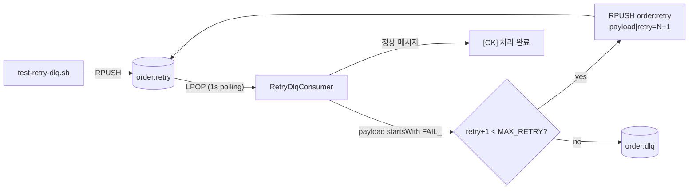

# Redis MQ 실습 프로젝트

Spring Boot 3.3 + Java 17 기반의 **메시지 큐 패턴 실습용** 미니 프로젝트입니다.
별도의 메시지 브로커 없이 **Redis** 하나로 다음 3가지 패턴을 단계별로 체험할 수 있습니다.

| 패턴 | Redis 자료구조 | 키 / 채널 | 컨슈머 |
|------|----------------|-----------|--------|
| 기본 큐 (List, FIFO) | `List` | `order:queue` | `OrderConsumer` |
| Pub/Sub | `Channel` | `order:event` | `OrderEventSubscriber` (3개 핸들러) |
| 재시도 + DLQ | `List` × 2 | `order:retry`, `order:dlq` | `RetryDlqConsumer` |

---

## 요구사항

- Java 17 (Temurin 권장)
- Redis 6+ (로컬 `localhost:6379`)
- `redis-cli` (테스트 스크립트가 사용)

## 실행

```bash
./gradlew bootRun
```

- 애플리케이션 포트: `8090` ([`src/main/resources/application.yml`](src/main/resources/application.yml))
- 모든 컨슈머/구독자는 자동 등록됩니다.

---

## 실습 1. 기본 큐 (List FIFO)

```bash
./test-orders.sh
```

- `order:queue`에 `ORDER-XX` 메시지 10건을 `RPUSH`
- [`OrderConsumer`](src/main/java/com/clone/mq/list/OrderConsumer.java)가 1초 폴링으로 `LPOP` 후 콘솔 출력

## 실습 2. Pub/Sub (1:N 브로드캐스트)

```bash
./test-events.sh
```

- `order:event` 채널로 `ORDER_COMPLETE:XX` 메시지 5건 발행
- [`OrderEventSubscriber`](src/main/java/com/clone/mq/pubsub/OrderEventSubscriber.java)의 3개 핸들러(재고/알림/배송)가 동시에 수신

## 실습 3. 재시도 + DLQ (신규 추가)

```bash
./test-retry-dlq.sh
```

- 시작 시 `order:retry`, `order:dlq` 키를 자동 정리(`DEL`)
- 실패 메시지 `FAIL_ORDER-9` 1건을 `order:retry`에 `RPUSH`
- [`RetryDlqConsumer`](src/main/java/com/clone/mq/list/RetryDlqConsumer.java)가 처리:
  - `FAIL_*` 페이로드는 항상 실패로 간주
  - `MAX_RETRY=3` 한도까지 큐에 다시 적재(재시도)
  - 한도 초과 시 `order:dlq`로 격리
- 결과: `RETRY` 블록 2개 + `DLQ` 블록 1개, DLQ 크기 = 1

---

## 재시도 + DLQ 동작 상세

### 메시지 포맷

```
ORDER-1                         # 신규 메시지 (retry=0 으로 간주)
ORDER-1|retry=2                 # 2회 재시도된 상태
FAIL_ORDER-9                    # 강제 실패 트리거 (학습용)
FAIL_ORDER-9|retry=1            # 강제 실패 + 1회 재시도된 상태
```

### 처리 흐름



### 로그 포맷

메시지 1건 = 블록 1개. 시퀀스 번호(`[#N]`)와 액션 라벨(`POP / OK / FAIL / RETRY / DLQ`)로 흐름이 한눈에 보입니다.

```
────────────────────────────────────────────────────────────
 [#1] POP   order:retry  ←  'FAIL_ORDER-9'
       parse payload=FAIL_ORDER-9, retry=0/3
       FAIL  → 강제 실패 트리거 감지
       RETRY → RPUSH order:retry  ←  'FAIL_ORDER-9|retry=1'
               다음 시도 1/2, order:retry 큐 크기=1
────────────────────────────────────────────────────────────
 [#2] POP   order:retry  ←  'FAIL_ORDER-9|retry=1'
       parse payload=FAIL_ORDER-9, retry=1/3
       FAIL  → 강제 실패 트리거 감지
       RETRY → RPUSH order:retry  ←  'FAIL_ORDER-9|retry=2'
               다음 시도 2/2, order:retry 큐 크기=1
────────────────────────────────────────────────────────────
 [#3] POP   order:retry  ←  'FAIL_ORDER-9|retry=2'
       parse payload=FAIL_ORDER-9, retry=2/3
       FAIL  → 강제 실패 트리거 감지
       DLQ   → MAX_RETRY(3) 초과 → RPUSH order:dlq  ←  'FAIL_ORDER-9'
               DLQ 크기=1  (조회: redis-cli LRANGE order:dlq 0 -1)
```

### 검증 명령

```bash
redis-cli LRANGE order:retry 0 -1   # 처리 중인 재시도 큐
redis-cli LRANGE order:dlq   0 -1   # 격리된 최종 실패 메시지
redis-cli DEL    order:retry order:dlq   # 수동 초기화
```

### 설계 메모

- 재시도는 **별도 스레드/타이머가 아니라**, 같은 컨슈머가 **메시지를 같은 큐 뒤에 다시 RPUSH**해 다음 폴링 사이클에 자기가 다시 꺼내 보는 “즉시 재시도” 방식입니다 (가장 단순한 형태).
- 정상 케이스(`OK`)는 [`test-orders.sh`](test-orders.sh)가 이미 시연하므로, [`test-retry-dlq.sh`](test-retry-dlq.sh)에는 **포함하지 않습니다** (재시도/DLQ 흐름에 집중).
- Pub/Sub 채널(`order:event`)에는 ack 개념이 없어 재시도 패턴이 자연스럽게 맞지 않습니다. 그래서 `RetryDlqConsumer`는 List 큐에만 연결되어 있습니다.

---

## 키 일람표

| 키 / 채널 | 용도 | 사용처 |
|-----------|------|--------|
| `order:queue` | 기본 큐 (실습 1) | [`OrderConsumer`](src/main/java/com/clone/mq/list/OrderConsumer.java), [`test-orders.sh`](test-orders.sh) |
| `order:event` | Pub/Sub 채널 (실습 2) | [`OrderEventSubscriber`](src/main/java/com/clone/mq/pubsub/OrderEventSubscriber.java), [`test-events.sh`](test-events.sh) |
| `order:retry` | 재시도 큐 (실습 3) | [`RetryDlqConsumer`](src/main/java/com/clone/mq/list/RetryDlqConsumer.java), [`test-retry-dlq.sh`](test-retry-dlq.sh) |
| `order:dlq` | Dead Letter Queue (실습 3) | 위와 동일 |

상수 정의: [`RedisConfig`](src/main/java/com/clone/mq/config/RedisConfig.java)

---

## 변경 이력

### v0.3 — Cursor 룰 추가

**추가**
- [`.cursor/rules/java-naming.mdc`](.cursor/rules/java-naming.mdc)
  - Java 변수명 컨벤션 (단일 문자/축약어 금지, 역할 기반 작명)
  - `globs: **/*.java` 매칭 시 자동 적용
  - 원본은 `.claude/skills/java-naming-validator/SKILL.md` (Claude Code용 스킬)
  - 두 시스템(Claude Skill / Cursor Rule)을 병행 유지하는 방식 채택

### v0.2 — 재시도 + DLQ 추가

**추가**
- [`src/main/java/com/clone/mq/list/RetryDlqConsumer.java`](src/main/java/com/clone/mq/list/RetryDlqConsumer.java)
  - `order:retry` 1초 폴링 소비
  - `FAIL_*` 페이로드는 강제 실패 트리거
  - `MAX_RETRY=3` 한도까지 즉시 재시도, 초과 시 `order:dlq`로 격리
  - 시퀀스 번호 + 구분선이 들어간 블록형 로그 출력
- [`test-retry-dlq.sh`](test-retry-dlq.sh)
  - 실행 시 `order:retry` / `order:dlq` 자동 초기화
  - `FAIL_ORDER-9` 1건만 적재해 RETRY 2 + DLQ 1 블록 시연

**수정**
- [`src/main/java/com/clone/mq/config/RedisConfig.java`](src/main/java/com/clone/mq/config/RedisConfig.java)
  - 상수 추가: `RETRY_QUEUE_KEY`, `DLQ_KEY`, `MAX_RETRY`

**무영향 (변경 없음)**
- [`OrderConsumer`](src/main/java/com/clone/mq/list/OrderConsumer.java), [`OrderEventSubscriber`](src/main/java/com/clone/mq/pubsub/OrderEventSubscriber.java)
- [`test-orders.sh`](test-orders.sh), [`test-events.sh`](test-events.sh)

### v0.1 — 초기

- 기본 큐(List) 소비 + Pub/Sub 구독자 데모
- 테스트 스크립트 2종(`test-orders.sh`, `test-events.sh`)

---

## 다음 확장 후보

- **Delay Queue**: `ZSET(score=실행시각)` 기반 지연 처리 (재시도 backoff에 활용 가능)
- **Idempotency**: `SET key value NX EX`로 중복 처리 방지
- **Redis Streams + Consumer Group**: ack/pending/reclaim까지 포함한 본격 MQ 모델
