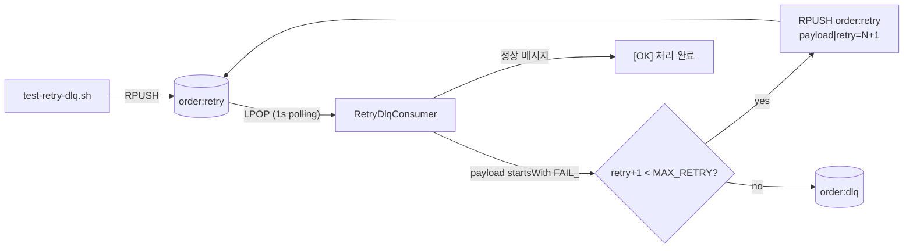

# Redis MQ 실습 프로젝트

Spring Boot 3.3 + Java 17 기반의 **메시지 큐 패턴 실습용** 미니 프로젝트입니다.
별도의 메시지 브로커 없이 **Redis** 하나로 다음 3가지 패턴을 단계별로 체험할 수 있습니다.

| 패턴 | Redis 자료구조 | 키 / 채널 | 컨슈머 |
|------|----------------|-----------|--------|
| 기본 큐 (List, FIFO) | `List` | `order:queue` | `OrderConsumer` |
| Pub/Sub | `Channel` | `order:event` | `OrderEventSubscriber` (3개 핸들러) |
| 재시도 + DLQ | `List` × 2 | `order:retry`, `order:dlq` | `RetryDlqConsumer` |

```
test-orders.sh ──RPUSH──► order:queue ──LPOP──► OrderConsumer
                                                   → "[Consumer] 주문 처리"

test-events.sh ──PUBLISH──► order:event ──► OrderEventSubscriber
                                              ├─ onStockUpdate  → "[재고] 차감"
                                              ├─ onNotification → "[알림] 발송"
                                              └─ onDelivery     → "[배송] 준비"

test-retry-dlq.sh ──RPUSH──► order:retry ──LPOP──► RetryDlqConsumer
                                ▲                     │ FAIL_ 감지?
                                │ retry < MAX          ├─ yes → RPUSH order:retry (재시도)
                                └──────────────────────┘ no  → RPUSH order:dlq  (격리)
```

---

## 요구사항

- Java 17 (Temurin 권장)
- Redis 6+ (로컬 `localhost:6379`)
- `redis-cli` (테스트 스크립트가 사용)

```bash
./gradlew bootRun   # 포트 8090, 모든 컨슈머/구독자 자동 등록
```

---

## 실습 1. 기본 큐 (List FIFO)

```bash
./test-orders.sh
```

- `order:queue`에 `ORDER-XX` 메시지 10건을 `RPUSH`
- [`OrderConsumer`](src/main/java/com/clone/mq/list/OrderConsumer.java)가 1초 폴링으로 `LPOP` 후 콘솔 출력

## 실습 2. Pub/Sub (1:N 브로드캐스트)

```bash
./test-events.sh
```

- `order:event` 채널로 `ORDER_COMPLETE:XX` 메시지 5건 발행
- [`OrderEventSubscriber`](src/main/java/com/clone/mq/pubsub/OrderEventSubscriber.java)의 3개 핸들러(재고/알림/배송)가 동시에 수신

## 실습 3. 재시도 + DLQ

```bash
./test-retry-dlq.sh
```

- 시작 시 `order:retry`, `order:dlq` 키를 자동 정리(`DEL`)
- 실패 메시지 `FAIL_ORDER-9` 1건을 `order:retry`에 `RPUSH`
- [`RetryDlqConsumer`](src/main/java/com/clone/mq/list/RetryDlqConsumer.java)가 처리:
  - `FAIL_*` 페이로드는 항상 실패로 간주
  - `MAX_RETRY=3` 한도까지 큐에 다시 적재(재시도)
  - 한도 초과 시 `order:dlq`로 격리



```bash
# 결과 확인
redis-cli LRANGE order:dlq 0 -1
```

---

## 파일 구조

| 파일 | 역할 |
|------|------|
| [`RedisConfig`](src/main/java/com/clone/mq/config/RedisConfig.java) | Bean 등록, Pub/Sub 리스너 컨테이너 |
| [`RedisQueue`](src/main/java/com/clone/mq/enums/RedisQueue.java) | 큐 키 enum (`ORDER`, `RETRY`, `DLQ`) |
| [`RedisChannel`](src/main/java/com/clone/mq/enums/RedisChannel.java) | 채널 키 enum (`ORDER_EVENT`) |
| [`RedisKeys`](src/main/java/com/clone/mq/config/RedisKeys.java) | 수치 상수 (`MAX_RETRY=3`) |
| [`OrderConsumer`](src/main/java/com/clone/mq/list/OrderConsumer.java) | 실습 1 — 기본 큐 소비 |
| [`OrderEventSubscriber`](src/main/java/com/clone/mq/pubsub/OrderEventSubscriber.java) | 실습 2 — Pub/Sub 핸들러 3개 |
| [`RetryDlqConsumer`](src/main/java/com/clone/mq/list/RetryDlqConsumer.java) | 실습 3 — 재시도 + DLQ |
